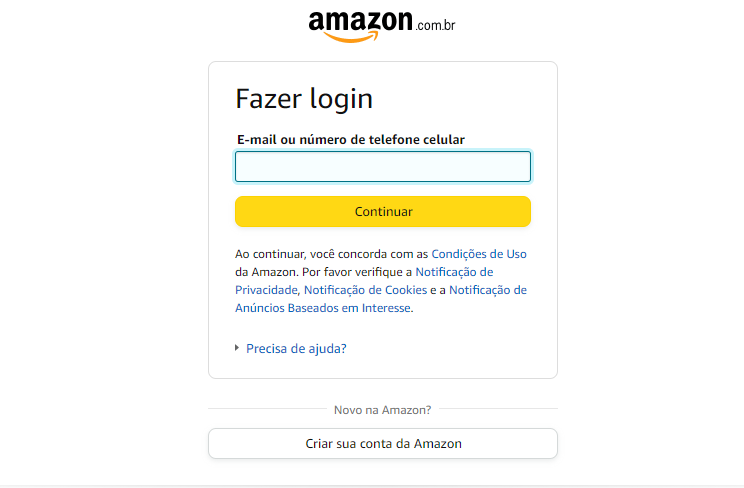
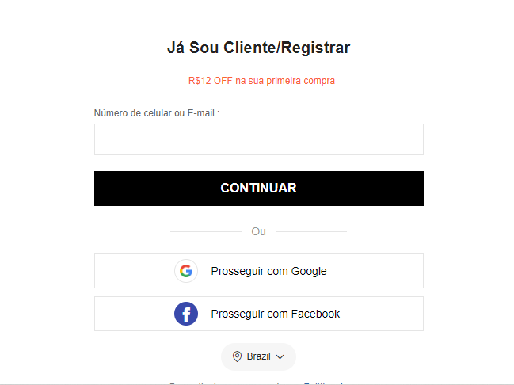

# form-CadEcommerce

# Indicie

* [Introdução](#introdução)

* [Metodos](#metodos)

* [Sites-utilizados](#sites-utilizados)

* [Tecnologias-utilizadas](#tecnologias-utilizadas)

* [Autores](#autores)

* [Detalhes](#detalhes)

# Introdução

 Essa atividade realizada na aula de fundamentos da web teve o intuito de mostrar exemplos de cadrastos para depois os alunos criarem um próprio.

# Metodos

 Foi utilizado sites E-commerce como exemplo para se ter alguma base de como é um cadastro real, tento noção do que normalmente pedem ou deixam de pedir no momento de criar um conta e quando vai comprar algo. E então anotamos todo o passo a passo dos diferentes cadastros.

# Sites utilizados

## 1º Site: Amazon
 
 Campos identificados no cadastro desse site:

- Nome
- Número ou e-mail
- Criar senha
- Verificar e-mail

#### Informar endereço 

- Local: Cidade, Estado...
- CEP
-ENDEREÇO (só é especificado quando colocado o CEP)
-Número de residência
-Complemento(opcional): Apartamento, sala...
- Bairro

## 2º Site: Shein

- E-mail
-Número de celular
- Código de verificação
- Método de pagamento
- Localização
- Primeiro nome
- Segundo nome
- Número de telefone
- CEP
- Linha de endereço 1 (só é especificado quando colocado o CEP)
- Número
- Estado
- Cidade
- Bairro
- CPF

 ## 3º Site: Mercado Livre

 Campos identificados no cadastro desse site:

- Email
- Escolher seu nome
- Reconhecimento facial
- Valide seu telefone
- Criar senha

#### Informar endereço:

- Informar RG/CNH
- Endereço particular: Rua ou avenida, Número, Cidade, Cep
- Ocupação
- Se é uma pessoa publicamente exposta

# Tecnologias utilizadas

 Word (para anotação) e pesquisa na internet.

# Autores

 - Sarah

# Detalhes

Alguns dos sites pedem verificação de e-mail ou de telefone, o mercado livre é o único que pede RG a reconhecimento facial, ocupação e é o único se perguntar se o cliente é uma pessoa pública, a Shein não pede senha.

ola